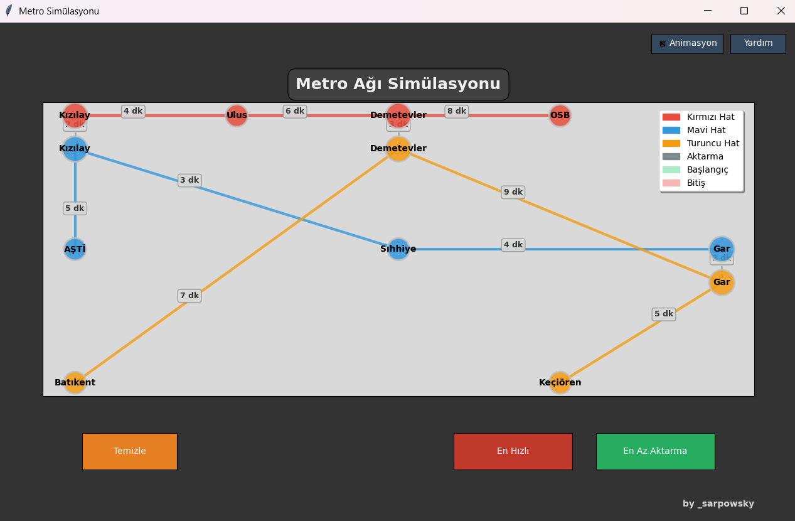

# Sürücüsüz Metro Simülasyonu (Rota Optimizasyonu)

## Proje Hakkında
Bu proje, Akbank ve Global AI Hub tarafından düzenlenen "Python ile Yapay Zekaya Giriş Bootcamp"ı kapsamında geliştirdiğim metro ağı simülasyonudur. Projede verilen bir metro ağında istasyonlar arası en hızlı ve en az aktarmalı rotaları bulan algoritmaları geliştirdim ve bunun görselleştirmesini yaptım.

## Kullanılan Teknolojiler ve Kütüphaneler
- **Python**: Temel programlama dili
- **tkinter**: GUI arayüzü için
- **matplotlib**: Metro ağının görselleştirilmesi ve çizimler için
- **networkx**: Graf yapısını oluşturmak ve yönetmek için
- **collections.deque**: BFS algoritması için kuyruk yapısı
- **heapq**: A* algoritması için öncelikli kuyruk yapısı
- **typing**: Tip kontrolü için

## Projedeki Katkım
Bu projede bootcamp tarafından temel metro ağı yapısı (`Istasyon` ve `MetroAgi` sınıfları) ve test durakları/hatları sağlanmıştır. Ben aşağıdaki bölümleri geliştirdim:

1. `SarpCanKaraman_MetroSimulation.py` dosyasındaki algoritma fonksiyonları:
   - `en_az_aktarma_bul`: BFS kullanarak en az aktarmalı rotayı bulan fonksiyon
   - `en_hizli_rota_bul`: A* algoritması kullanarak en hızlı rotayı bulan fonksiyon

2. `metro_simulation.py` dosyası ( projedeki algoritmanın geliştirilmiş versiyonunu içerir)
   - Burada özellikle `en_az_aktarma_bul` fonksiyonunu BFS yerine Dijkstra tabanlı bir yaklaşımla yeniden düzenledim

3. Görselleştirme modülü ve arayüzün tamamı:
   - Metro ağının grafiksel temsili
   - İstasyon seçme mekanizması
   - Rota görselleştirmesi
   - Animasyon sistemi

## Algoritmaların Çalışma Mantığı

### BFS (Breadth-First Search) Algoritması
İlk olarak en az aktarmalı rotayı bulmak için BFS algoritması kullandım (`SarpCanKaraman_MetroSimulation.py`). Bu algoritma en kısa yolu bulmak için tüm komşu düğümleri eşit seviyede ziyaret eder. Ancak testler sırasında (özellikle Mavi Hattaki Gar durağından Kırmızı Hattaki Demetevler durağına giderken) BFS'in beklediğim en az aktarmalı rotayı bulamadığını fark ettim. BFS sadece en kısa düğüm sayısını bulduğu için, hat değişimlerini (aktarmaları) özel olarak değerlendirmiyordu.

### Dijkstra Modifikasyonu (metro_simulation.py)
Bu problemi çözmek için, `metro_simulation.py` dosyasında `en_az_aktarma_bul` fonksiyonunu Dijkstra algoritması kullanarak yeniden tasarladım. Bu versiyonda hat değişimlerine çok yüksek maliyetler atayarak (1000 birim) öncelikle aktarma sayısını, daha sonra istasyon sayısını minimize eden bir çözüm geliştirdim.

### A* Algoritması
En hızlı rotayı bulmak için A* algoritmasını kullandım. Bu algoritma, hedef odaklı bir arama yaparak istasyonlar arası süreleri dikkate alıp en kısa zamanda hedefe ulaşan rotayı bulur.

## Geliştirme Süreci ve Zorluklar

Proje yaklaşık iki hafta sürdü ve birkaç zorluğu aşmam gerekti:

1. **Algoritma Problemi**: BFS'in bazı durumlarda beklenen en az aktarmalı rotayı bulamaması sorunu, algoritmaları daha derin anlamamı gerektirdi. Dijkstra algoritmasını bu probleme özel olarak modifiye etmek, algoritma bilgimi pekiştirdi.

2. **Görselleştirme Zorlukları**: Metro ağını görsel olarak anlamlı bir şekilde sunmak, istasyonları doğru konumlandırmak (özellikle aktarma noktalarını) ve hat renklerini yönetmek için kapsamlı bir çalışma gerekti.

## Proje Özellikleri

### Ana Özellikler
- İki istasyon arasındaki en az aktarmalı rotayı bulma 
- İki istasyon arasındaki en hızlı rotayı bulma
- Metro ağının görsel temsili
- Rotaların animasyonlu gösterimi

### Ekstra Geliştirmeler
- Kullanıcı dostu grafik arayüzü
- İstasyonlar arası geçiş sürelerini gösterme
- Hat değişimlerini vurgulama
- Farklı hatları renklendirme
- İnteraktif istasyon seçimi

### Projeden Görüntüler
- 
- 
- 

## Projenin Çalıştırılması

Mentorlerimizin projeyi kendi bilgisayarlarında test edebilmesi için:

1. Repository'yi bilgisayarınıza klonlayın
2. Python 3.6 veya üzeri bir sürüm kullanıldığından emin olun
3. Gerekli kütüphaneleri yükleyin:
   ```
   pip install matplotlib networkx
   ```
4. Ana uygulamayı çalıştırın:
   ```
   python metro_gui.py
   ```

## Kullanım
1. İstasyonlara tıklayarak başlangıç ve bitiş noktaları seçin
2. "En Az Aktarma" veya "En Hızlı" butonlarıyla rota hesaplamasını başlatın
3. Animasyon özelliğiyle rotayı canlı olarak izleyin
4. "Temizle" butonu ile seçimleri sıfırlayın

## Yapılabilecek Geliştirme Fikirleri

Bu fikirde bir proje için genişlediği durumda yapılabilecek geliştirmeler şu yönlerde olabilir:

1. **Gerçek Metro Verisi Entegrasyonu**: Ankara, İstanbul, İzmir gibi şehirlerin gerçek metro ağlarını içeri aktarabilme özelliği.

2. **Yapay Zeka Tabanlı Yolcu Tahmini**: Makine öğrenmesi modelleri kullanarak saatlere göre yolcu yoğunluğunu tahmin etme ve rota planlamasında kullanma.

3. **Zaman Bazlı Rota Optimizasyonu**: Gün içindeki farklı saatlere (yoğun/sakin saatler) göre seyahat sürelerini dinamik olarak hesaplama.

4. **3D Görselleştirme**: Metro istasyonlarının ve hatlarının 3 boyutlu modellemesini yaparak daha gerçekçi bir görselleştirme.

5. **Çoklu Ulaşım Modları**: Metro ile birlikte otobüs, tramvay gibi diğer toplu taşıma araçlarını da dahil ederek kapıdan kapıya rota planlama.

6. **İstasyon İçi Navigasyon**: Büyük aktarma istasyonlarının içindeki en kısa yolu bulma (örneğin, giriş kapısından platforma).

7. **Mobil Uygulama**: Projenin mobil cihazlarda çalışacak versiyonunu geliştirme.

8. **Alternatif Rotalar**: Tek bir rota yerine, kullanıcıya farklı öncelikler sunarak (en hızlı, en az aktarma, en az yürüyüş) birden fazla alternatif sunma.

9. **Gerçek Zamanlı Veri Entegrasyonu**: Metro sistemindeki gecikme, arıza gibi bilgileri API'ler aracılığıyla çekerek rotaları güncel duruma göre yeniden hesaplama.

10. **Erişilebilirlik Özellikleri**: Engelli bireylere uygun rotaları önceliklendiren filtreleme seçenekleri.

## Sonuç
Algoritma tasarımı ve implementasyonu konusunda değerli deneyimler kazandığım bir proje oldu. Özellikle teoride basit görünen BFS algoritmasının pratikte karşılaştığı sorunları çözmek için algoritma modifikasyonu yapmak, problem çözme becerilerimi geliştirdi. Görselleştirme kısmında matplotlib ve networkx kütüphaneleriyle çalışmak da gelecekteki projelerimde kullanabileceğim önemli yetenekler kazandırdı.
